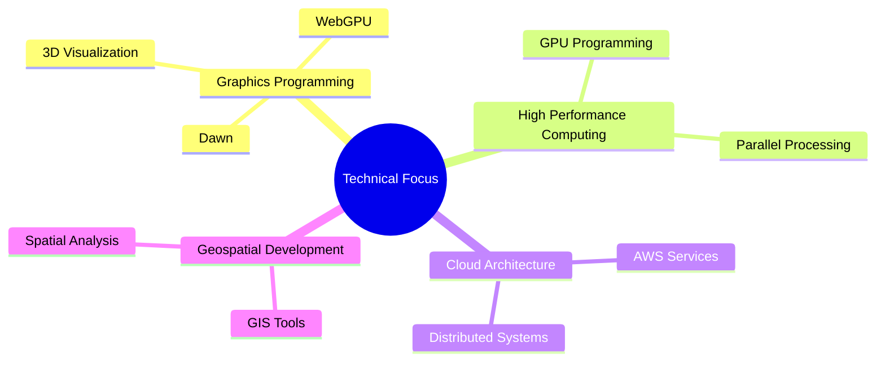

# Welcome! 

I'm Brendan Barnes, a Software Engineer passionate about solving complex engineering challenges. I've spent my career bridging the gap between civil engineering and modern software development:

* 🚀 Developing highly optimized computational solutions, especially using GPU acceleration and parallel processing
* 💻 Creating software in C++, Python, and TypeScript
* 🌐 Building cloud-native applications and distributed systems using AWS
* 🗺️ Specializing in geospatial software development and large-scale data processing
* 👷 Combining civil engineering domain knowledge with modern software practices to create innovative solutions
* 🎨 Exploring computer graphics and 3D visualization through WebGPU

I love tackling challenging technical problems and am always excited to explore new technologies. Currently diving deep into WebGPU and modern graphics programming, exploring the future of cross-platform GPU computing!

## 📫 Get in Touch

- Email: brendan.barnes856@gmail.com
- Location: St. Paul, MN

## 🛠️ Technologies & Tools

## 🎯 Focus Areas

